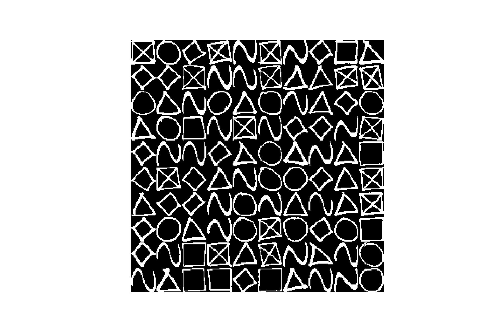
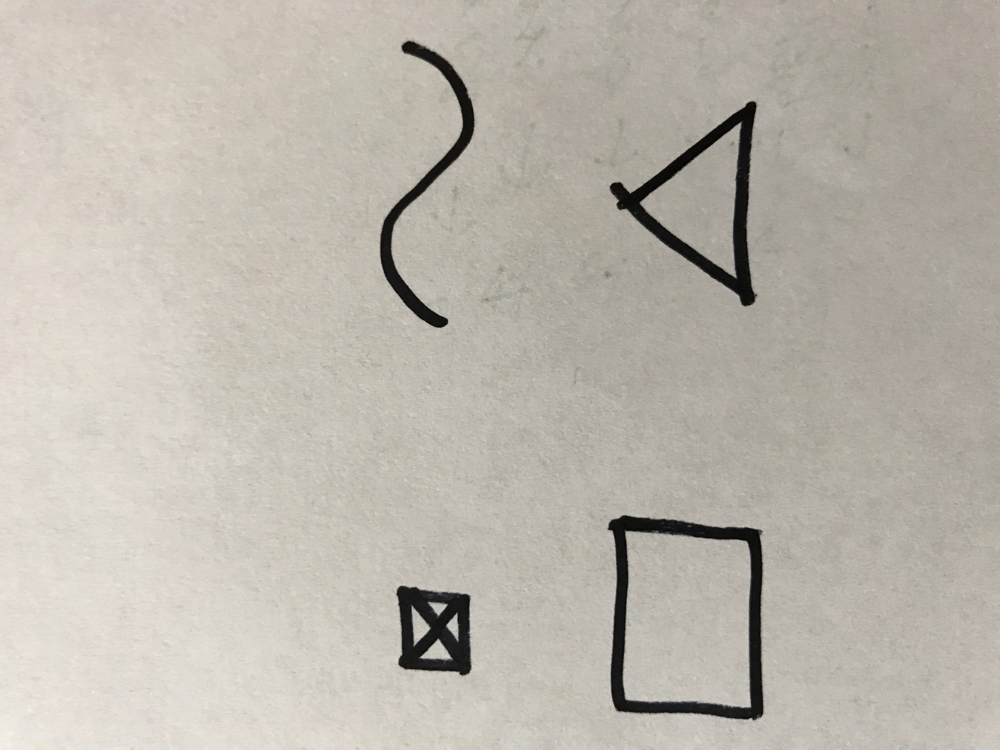
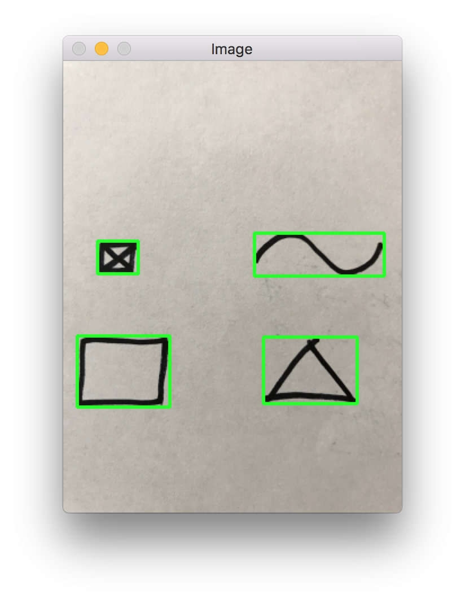
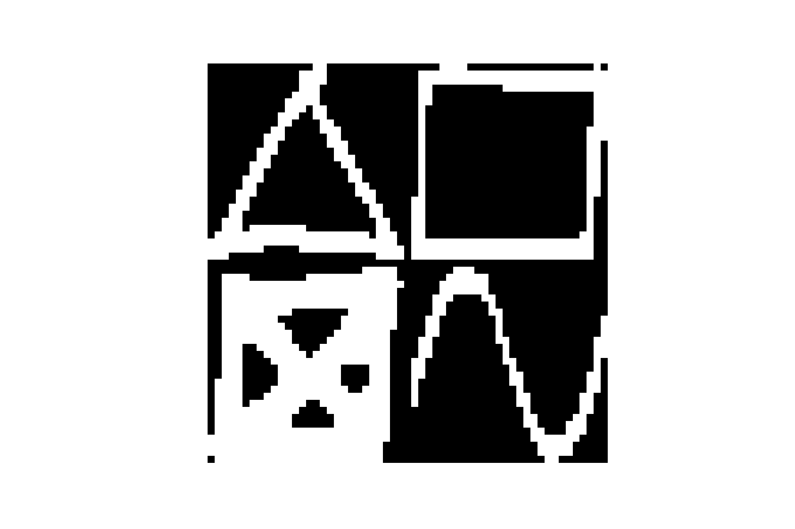

## Sketch Detection

### Dataset

<p align="center">
 
</p>

### File Structure

- Run `create_labels.py` to read train directory and create `X` and `y` arrays.
- Run `bounding_box.py` to view detected bounding boxes on test image.
- Run `segment.py` to extract content of bounding boxes and save as pickle dump.
- Run jupyter notebook `Playground` to train the network and test the images.

### Testing Pipeline

- preprocess
- extract contours
- from contours compute bounding box
- dump content of each bounding box as numpy array
- feed to neural network

### Results

**Test Image**

<p align="center">
 
</p>

**Detected Contours and Bounding Box**

<p align="center">
 
</p>

**Processed Numpy Array**

<p align="center">
 
</p>

**Predictions**

```python
Gd Truth: ['triangle', 'square', 'cross', 'squiggly']
Predictions: ['triangle', 'square', 'cross', 'squiggly']
Accuracy: 4/4 (100%)
```


